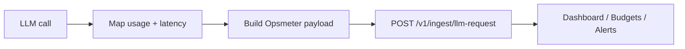

# Opsmeter Integration Examples

[](https://github.com/opsmeter-io/opsmeter.io-integration-examples/actions/workflows/ci.yml)
[](https://github.com/opsmeter-io/opsmeter.io-integration-examples/tags)
[](https://github.com/opsmeter-io/opsmeter.io-integration-examples/blob/master/LICENSE)
[](https://www.npmjs.com/package/@opsmeter/node)
[](https://pypi.org/project/opsmeter-sdk/)

> **Provider changes, Opsmeter payload stays the same.**

Working examples for sending telemetry to `POST /v1/ingest/llm-request` in:
- .NET (`examples/dotnet`)
- Node.js (`examples/node`)
- Python (`examples/python`)

This repo is optimized for teams implementing **LLM cost tracking**, **OpenAI usage monitoring**, **Anthropic usage telemetry**, and **AI inference cost control** with a consistent request schema.

Opsmeter product site: [https://opsmeter.io](https://opsmeter.io)  
Opsmeter API base: [https://api.opsmeter.io](https://api.opsmeter.io)
Provider + catalog model names: [https://opsmeter.io/docs/catalog](https://opsmeter.io/docs/catalog)
Official SDK package identities for opsmeter.io:
- Node (npm): [@opsmeter/node](https://www.npmjs.com/package/@opsmeter/node)
- Python (PyPI): [opsmeter-sdk](https://pypi.org/project/opsmeter-sdk/)

Current provider support in examples: **OpenAI** and **Anthropic** only.

This repository targets **LLM telemetry quickstart**, **OpenAI cost tracking examples**, **Anthropic integration examples**, and **AI cost observability setup** keywords.

## What this repo solves

- **No-proxy telemetry:** keep your provider call path untouched, send attribution metadata after each LLM call.
- **Retry-safe ingestion:** reuse `externalRequestId` on retries to prevent duplicate request rows.
- **Cost attribution dimensions:** keep `endpointTag` and `promptVersion` consistent for feature-level and version-level analysis.

## Documentation paths

- **Direct ingest (current production path):** Quickstart + payload contract + language examples under `examples/`.
- **SDK auto-instrumentation (preview path):** moved to dedicated SDK repositories.
- Direct ingest docs stay valid; SDK docs are additive and do not replace existing integration docs.

## Official package identity (opsmeter.io)

- Official domain and product identity: [https://opsmeter.io](https://opsmeter.io)
- Official Node package name: `@opsmeter/node`
- Official Python package name: `opsmeter-sdk`
- Model catalog for both SDKs: [https://opsmeter.io/docs/catalog](https://opsmeter.io/docs/catalog)

## Table of contents

- [Quickstart (60s)](#quickstart-60s)
- [Documentation paths](#documentation-paths)
- [Official package identity (opsmeter.io)](#official-package-identity-opsmeterio)
- [Payload contract (shared)](#payload-contract-shared)
- [Allowed values](#allowed-values)
- [Recommended combinations](#recommended-combinations)
- [Architecture](#architecture)
- [Quick visual](#quick-visual)
- [Examples](#examples)
- [Example modes](#example-modes)
- [SDK preview](#sdk-preview)
- [n8n templates](#n8n-templates)
- [Common mistakes](#common-mistakes)
- [CI / Quality gates](#ci--quality-gates)
- [Product linking text (for docs/pricing/landing)](#product-linking-text-for-docspricinglanding)
- [Release](#release)
- [SEO and discoverability notes](#seo-and-discoverability-notes)

## Quickstart (60s)

1) Clone and set your API key.

```bash
git clone https://github.com/opsmeter-io/opsmeter.io-integration-examples.git
cd opsmeter-integration-examples
export OPSMETER_API_KEY="<YOUR_WORKSPACE_PRIMARY_API_KEY>"
export OPSMETER_API_BASE_URL="https://api.opsmeter.io"
```

2) Run one stack (Node shown below):

```bash
# Provider/model names: https://opsmeter.io/docs/catalog
node examples/node/index.mjs --provider openai --model gpt-4o-mini --retry
```

3) Expected output:

```text
Business call completed.
Telemetry dispatched (non-blocking).
Ingest response: 200 ok=true planTier=Free warnings=0
Retry with same externalRequestId sent.
```

4) Verify in product:
- Dashboard request count increases.
- `endpointTag` and `promptVersion` appear in Top Endpoints / Prompt Versions.

> `--retry` uses the **same** `externalRequestId` to demonstrate retry-safe behavior.

## Payload contract (shared)

Canonical ingest endpoint: `https://api.opsmeter.io/v1/ingest/llm-request`

All examples send this same shape:

```json
{
  "externalRequestId": "ext_123abc",
  "provider": "openai",
  "model": "gpt-4o-mini",
  "promptVersion": "summary_v3",
  "endpointTag": "checkout.ai_summary",
  "inputTokens": 120,
  "outputTokens": 45,
  "totalTokens": 165,
  "latencyMs": 820,
  "status": "success",
  "errorCode": null,
  "userId": null,
  "dataMode": "real",
  "environment": "prod"
}
```

`provider` and `model` values should be selected from the catalog: [https://opsmeter.io/docs/catalog](https://opsmeter.io/docs/catalog)

### Allowed values

| Field | Allowed | Notes |
|---|---|---|
| `provider` | `openai`, `anthropic` | Current support in this repo/examples |
| `status` | `success`, `error` | Required by API validation |
| `dataMode` | `real`, `test`, `demo` | Default recommendation: `real` |
| `environment` | `prod`, `staging`, `dev` | Use real deployment environment |

### Recommended combinations

| Use case | `dataMode` | `environment` |
|---|---|---|
| Production traffic | `real` | `prod` |
| QA/Test traffic | `test` | `staging` or `dev` |
| Seed/demo flows | `demo` | `dev` |

If you do not label these fields correctly, dashboard analytics can mix operational and non-production signals.

## Architecture



## Quick visual


## Examples

- [Node examples (without SDK + with SDK)](./examples/node/README.md)
- [Python examples (without SDK + with SDK)](./examples/python/README.md)
- [Dotnet examples (without SDK + with SDK)](./examples/dotnet/README.md)

### Example modes

- **Without SDK (direct ingest):** existing stable production path in this repo.
- Includes explicit send scenarios for both OpenAI and Anthropic.
- **With SDK (preview):** usage examples in this repo, SDK packages in dedicated repos:
  - Includes OpenAI + Anthropic capture/send scenarios in language samples.
  - Node SDK repo: [github.com/opsmeter-io/opsmeter.io-node-sdk](https://github.com/opsmeter-io/opsmeter.io-node-sdk)
  - Node npm package (published): [npmjs.com/package/@opsmeter/node](https://www.npmjs.com/package/@opsmeter/node)
  - Python SDK repo: [github.com/opsmeter-io/opsmeter.io-python-sdk](https://github.com/opsmeter-io/opsmeter.io-python-sdk)
  - Python package (published): [pypi.org/project/opsmeter-sdk](https://pypi.org/project/opsmeter-sdk/)
  - .NET SDK repo: coming soon

## SDK preview

Preview SDK contracts and reference implementations are maintained in dedicated repositories:

- Node SDK (repo): [github.com/opsmeter-io/opsmeter.io-node-sdk](https://github.com/opsmeter-io/opsmeter.io-node-sdk)
- Node SDK (npm): [npmjs.com/package/@opsmeter/node](https://www.npmjs.com/package/@opsmeter/node)
- Python SDK (repo): [github.com/opsmeter-io/opsmeter.io-python-sdk](https://github.com/opsmeter-io/opsmeter.io-python-sdk)
- Python SDK (PyPI): [pypi.org/project/opsmeter-sdk](https://pypi.org/project/opsmeter-sdk/)
- .NET SDK (repo): coming soon
- .NET package: coming soon

## n8n templates

These templates are for **Opsmeter n8n integration** with workspace status branching, budget warning automation, and telemetry paused handling.

Path: `./n8n`

- `workspace-status-check.json`: polls `GET /v1/diagnostics/workspace-status` and branches by plan/budget booleans.
- `budget-warning-to-slack.json`: scheduled budget status check with Slack notification path.
- `openai-to-opsmeter-ingest.json`: provider call + usage mapping + ingest + 402 plan-limit branch.
- Import and setup guide: [`n8n/README.md`](./n8n/README.md)

## Common mistakes

> **Common mistakes**
> - Provider/model typo (example: wrong provider string), causing unknown model attribution.
> - Generating a new `externalRequestId` for retries (breaks idempotent behavior).
> - Blocking the request path with long telemetry timeouts.
> - Treating telemetry failure as business failure (it should be swallowed/logged).

## CI / Quality gates

- Node lint + tests
- Python lint + tests
- Dotnet build + tests
- Smoke script runs all three examples in dry-run mode

See `.github/workflows/ci.yml` and `scripts/smoke.sh`.

## Product linking text (for docs/pricing/landing)

Use this exact label when linking from the main product:

`Integration examples (60-second quickstart)`

Target URL:

`https://github.com/opsmeter-io/opsmeter.io-integration-examples`

## Release

Current bootstrap release target: **v0.1.0** (see [CHANGELOG](./CHANGELOG.md)).

## SEO and discoverability notes

Primary terms covered in this repository:
- Opsmeter integration examples
- LLM cost tracking integration
- OpenAI usage monitoring
- Anthropic telemetry integration
- AI inference cost control
