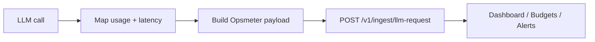

# Opsmeter Integration Examples

[](https://github.com/opsmeter/opsmeter-integration-examples/actions/workflows/ci.yml)
[](https://github.com/opsmeter/opsmeter-integration-examples/tags)
[](https://github.com/opsmeter/opsmeter-integration-examples/blob/master/LICENSE)

> **Provider changes, Opsmeter payload stays the same.**

Working examples for sending telemetry to `POST /v1/ingest/llm-request` in:
- .NET (`examples/dotnet`)
- Node.js (`examples/node`)
- Python (`examples/python`)

This repo is optimized for teams implementing **LLM cost tracking**, **OpenAI usage monitoring**, **Anthropic usage telemetry**, and **AI inference cost control** with a consistent request schema.

## Quickstart (60s)

1) Clone and set your API key.

```bash
git clone https://github.com/opsmeter/opsmeter-integration-examples.git
cd opsmeter-integration-examples
export OPSMETER_API_KEY="<YOUR_WORKSPACE_PRIMARY_API_KEY>"
```

2) Run one stack (Node shown below):

```bash
node examples/node/index.mjs --provider openai --model gpt-4o-mini --retry
```

3) Expected output:

```text
Business call completed.
Telemetry dispatched (non-blocking).
Ingest response: 200 ok=true planTier=Free warnings=0
Retry with same externalRequestId sent.
```

4) Verify in product:
- Dashboard request count increases.
- `endpointTag` and `promptVersion` appear in Top Endpoints / Prompt Versions.

> `--retry` uses the **same** `externalRequestId` to demonstrate retry-safe behavior.

## Payload contract (shared)

All examples send this same shape:

```json
{
  "externalRequestId": "ext_123abc",
  "provider": "openai",
  "model": "gpt-4o-mini",
  "promptVersion": "summary_v3",
  "endpointTag": "checkout.ai_summary",
  "inputTokens": 120,
  "outputTokens": 45,
  "totalTokens": 165,
  "latencyMs": 820,
  "status": "success",
  "errorCode": null,
  "userId": null,
  "dataMode": "real",
  "environment": "prod"
}
```

### Allowed values

| Field | Allowed | Notes |
|---|---|---|
| `status` | `success`, `error` | Required by API validation |
| `dataMode` | `real`, `test`, `demo` | Default recommendation: `real` |
| `environment` | `prod`, `staging`, `dev` | Use real deployment environment |

### Recommended combinations

| Use case | `dataMode` | `environment` |
|---|---|---|
| Production traffic | `real` | `prod` |
| QA/Test traffic | `test` | `staging` or `dev` |
| Seed/demo flows | `demo` | `dev` |

If you do not label these fields correctly, dashboard analytics can mix operational and non-production signals.

## Architecture



## Quick visual


## Examples

- [Node example](./examples/node/README.md)
- [Python example](./examples/python/README.md)
- [Dotnet example](./examples/dotnet/README.md)

## Common mistakes

> **Common mistakes**
> - Provider/model typo (example: wrong provider string), causing unknown model attribution.
> - Generating a new `externalRequestId` for retries (breaks idempotent behavior).
> - Blocking the request path with long telemetry timeouts.
> - Treating telemetry failure as business failure (it should be swallowed/logged).

## CI / Quality gates

- Node lint + tests
- Python lint + tests
- Dotnet build + tests
- Smoke script runs all three examples in dry-run mode

See `.github/workflows/ci.yml` and `scripts/smoke.sh`.

## Product linking text (for docs/pricing/landing)

Use this exact label when linking from the main product:

`Integration examples (60-second quickstart)`

Target URL:

`https://github.com/opsmeter/opsmeter-integration-examples`

## Release

Current bootstrap release target: **v0.1.0** (see [CHANGELOG](./CHANGELOG.md)).
